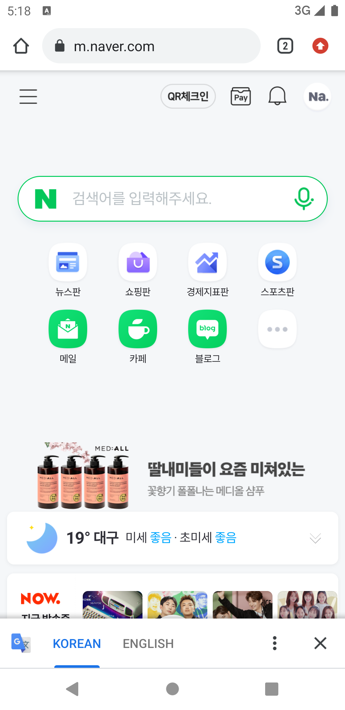
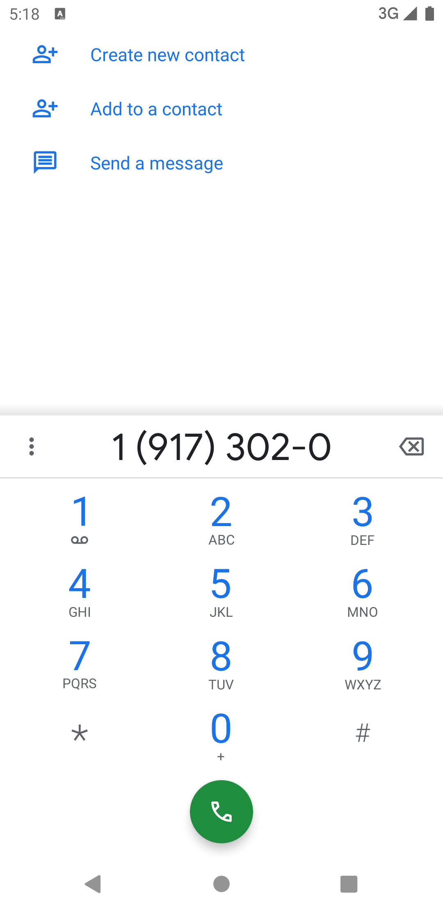
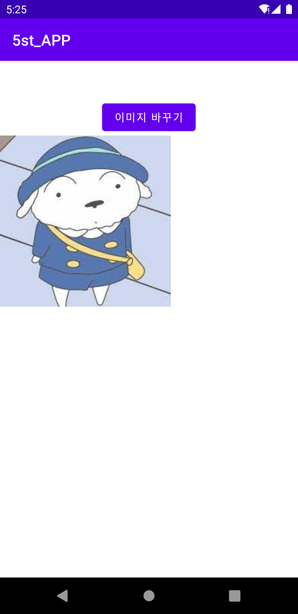
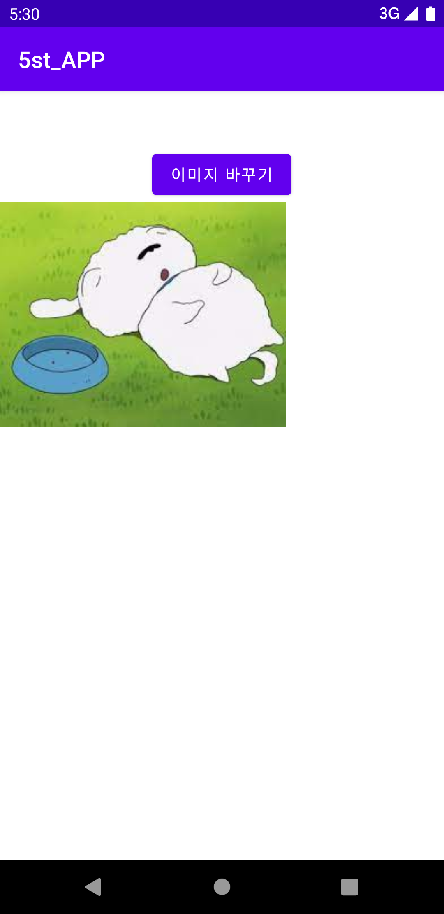

# 19173020_kre_android_App1

## 1주차

## 2주차
  -Github 사용법
  
</img>
</img>
## 3주차

</img>
</img>

## 4주차

   - 아이디어 명 : 제로 웨이스트 캠페인 실천 앱 
   - 최근 코로나19의 영향으로 배달 음식 이용이 크게 늘어나며 무분별한 일회용품 사용으로 인해 환경오염이 더욱 가속화되고 있다. 이 앱은 이러한 문제로 인한 환경 오염을 줄이기 위해 제로 웨이스트 캠페인을 실천하도록 돕는 것이 주된 목표이다. 제로 웨이스트에 참여하는 가게들과 협약을 맺고 가게 목록을 정리하여 소개하는 카테고리를 만든다. 다회용 용기를 사용하여 포장 시 할인 제도를 적용하고, 다회용 컵 사용 시 협약을 맺은 가게 중 어느 곳이든 반납할 수 있도록 하며 반납한 컵은 깨끗하게 세척하여 같은 방식으로 순환하여 재사용한다. 이러한 방식들로 제로 웨이스트 캠페인 실천을 돕는 앱이다.

## 5주차

</img>
</img>

## 6주차
